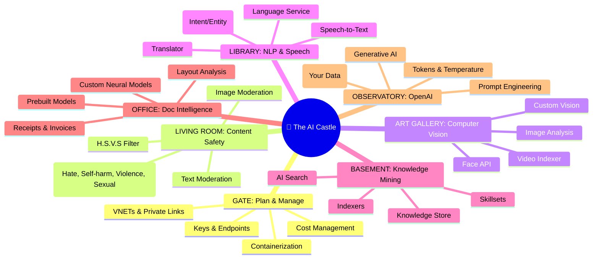
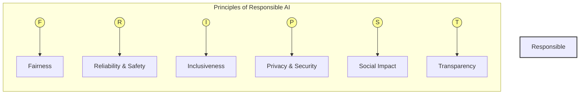

# AI-102 Visual Study Map

This document uses Mermaid diagrams to visualize the AI-102 "Memory Palace" structure.

## 🏰 The AI Castle Map (Mermaid)

```mermaid
mindmap
  root((🏰 The AI Castle))
    GATE: Plan & Manage
      ::icon(fa fa-key)
      Keys & Endpoints
      Cost Management
      VNETs & Private Links
      Containerization
    LIVING ROOM: Content Safety
      ::icon(fa fa-shield)
      Text Moderation
      Image Moderation
      H.S.V.S Filter
      (Hate, Self-harm, Violence, Sexual)
    ART GALLERY: Computer Vision
      ::icon(fa fa-eye)
      Image Analysis
      Face API
      Custom Vision
      Video Indexer
    LIBRARY: NLP & Speech
      ::icon(fa fa-book)
      Language Service
      Translator
      Speech-to-Text
      CLU (Intent/Entity)
    BASEMENT: Knowledge Mining
      ::icon(fa fa-search)
      AI Search
      Indexers
      Skillsets
      Knowledge Store
    OFFICE: Doc Intelligence
      ::icon(fa fa-file-invoice)
      Prebuilt Models
      Layout Analysis
      Custom Neural Models
      Receipts & Invoices
    OBSERVATORY: OpenAI
      ::icon(fa fa-star)
      Generative AI
      Prompt Engineering
      Tokens & Temperature
      RAG (Your Data)
```

## 🧠 Mnemonics Visualization

```mermaid
graph TD
    subgraph Responsible AI [Principles of Responsible AI]
        direction TB
        F((F)) --> Fairness[Fairness]
        R((R)) --> Rel[Reliability & Safety]
        I((I)) --> Incl[Inclusiveness]
        P((P)) --> Priv[Privacy & Security]
        S((S)) --> Soc[Social Impact]
        T((T)) --> Trans[Transparency]
    end
    
    style Responsible AI fill:#f9f,stroke:#333,stroke-width:2px
    style F fill:#ff9,stroke:#333
    style R fill:#ff9,stroke:#333
    style I fill:#ff9,stroke:#333
    style P fill:#ff9,stroke:#333
    style S fill:#ff9,stroke:#333
    style T fill:#ff9,stroke:#333
```
